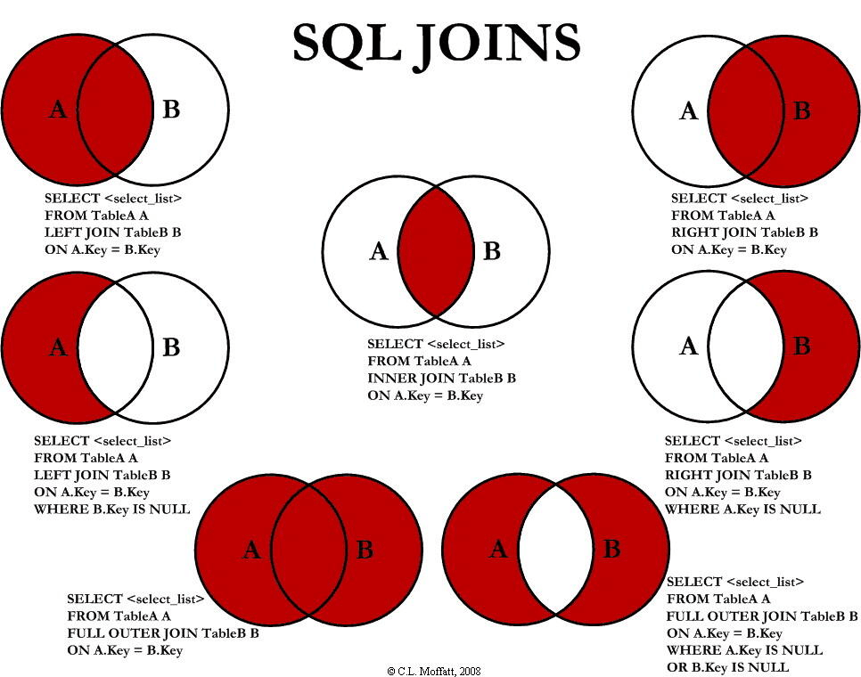

# SQL 快速入门手册（简体中文版）
版本：1.5  
作者: MKCorleonE (https://mkcorleone.github.io/)  
仓库: https://github.com/MKCorleonE/GavinTechNoahsArk.git/00_Fundamentals/SQL.md  
鸣谢: 菜鸟教程 (https://www.runoob.com/sql/sql-tutorial.html)
## 目录
- [1 SQL 简介](#1-sql-简介)
  - [1.1 SQL是什么?](#11-sql是什么)
  - [1.2 SQL 能做什么？](#12-ql-能做什么)
- [2 SQL 语法引言](#2-sql-语法引言)
  - [2.1 数据库表](#21-数据库表)
  - [2.2 关于大小写](#22-关于大小写)
  - [2.3 关于分号结尾](#23-关于分号结尾)
- [3 SQL 语句](#3-sql-语句)
  - [3.1 SELECT 语句](#31-select-语句)
  - [3.2 SELECT DISTINCT 语句](#32-select-distinct-语句)
  - [3.3 INSERT INTO 语句](#33-insert-into-语句)
  - [3.4 UPDATE 语句](#34-update-语句)
  - [3.5 DELETE 语句](#35-delete-语句)
- [4 SQL 进阶语句](#4-sql-进阶语句)
  - [4.1 SELECT TOP (LIMIT) 语句](#41-select-top-(limit)-语句)
  - [4.2 LIKE 语句](#42-like-语句)
  - [4.3 IN 语句](#43-in-语句)
  - [4.4 GROUP BY 语句](#44-group-by-语句)
  - [4.5 HAVING 语句](#45-having-语句)
  - [4.6 EXISTS 语句](#46-exists-语句)
  - [4.7 BETWEEN 语句](#47-between-语句)
  - [4.8 As 语句](#48-as-语句)
  - [4.9 JOIN 语句](#49-join-语句)
  - [4.10 UNION 语句](#410-union-语句)
  - 

- [5 SQL 函数](#5-sql-函数)
  - [5.1 AVG() 函数](#51-avg-函数)
  - [5.2 COUNT() 函数](#52-count-函数)
  - [5.3 FIRST() 函数](#53-first-函数)
  - [5.4 LAST() 函数](#54-last-函数)
  - [5.5 MAX() 函数](#55-max-函数)
  - [5.6 MIN() 函数](#56-min-函数)
  - [5.7 SUM() 函数](#57-sum-函数)
  - [5.8 UCASE() 函数](#58-ucase-函数)
  - [5.9 LCASE() 函数](#59-lcase-函数)
  - [5.10 MID() 函数](#510-mid-函数)
  - [5.11 LEN() 函数](#511-len-函数)
  - [5.12 ROUND() 函数](#512-round-函数)
  - [5.13 NOW() 函数](#513-now-函数)
  - [5.14 FORMAT() 函数](#514-format-函数)
  - [5.15 CONCAT() 函数](#515-concat-函数)
- [6 SQL 数据类型](#6-sql-数据类型)
- [7 SQL 快速参考](#7-sql-快速参考)

## 1 SQL 简介
> SQL (Structured Query Language:结构化查询语言) 是用于管理关系数据库管理系统（RDBMS）。SQL 通过一系列的语句和命令来执行数据定义、数据查询、数据操作和数据控制等功能,包括数据插入、查询、更新和删除，数据库模式创建和修改，以及数据访问控制。

### 1.1 SQL是什么?
- SQL 指结构化查询语言，全称是 Structured Query Language。
- SQL 让您可以访问和处理数据库，包括数据插入、查询、更新和删除。
- SQL 语言采用英语关键词，使其易读易写。
- SQL 由国际标准化组织（ISO）和美国国家标准协会（ANSI）标准化。
- SQL 提供了丰富的操作数据的功能，从简单的查询到复杂的数据库管理操作。

### 1.2 SQL 能做什么？
- SQL 面向数据库执行查询
- SQL 可从数据库取回数据
- SQL 可在数据库中插入新的记录
- SQL 可更新数据库中的数据
- SQL 可从数据库删除记录
- SQL 可创建新数据库
- SQL 可在数据库中创建新表
- SQL 可在数据库中创建存储过程
- SQL 可在数据库中创建视图
- SQL 可以设置表、存储过程和视图的权限

### RDBMS
>RDBMS 指关系型数据库管理系统，全称 Relational Database Management System。
RDBMS 是 SQL 的基础，同样也是所有现代数据库系统的基础，比如 MS SQL Server、IBM DB2、Oracle、MySQL 以及 Microsoft Access。RDBMS 中的数据存储在被称为表的数据库对象中。表是相关的数据项的集合，它由列和行组成。

## 2 SQL 语法引言
> SQL（Structured Query Language）是一种用于管理和操作关系数据库的标准语言，包括数据查询、数据插入、数据更新、数据删除、数据库结构创建和修改等功能。

| SQL 核心分类       | 语句                     |
|--------------------|------------------------------|
| 性能优化与安全性   | EXPLAIN、TRANSACTION、GRANT、REVOKE |
| 基本查询语句       | SELECT、WHERE、ORDER BY、DISTINCT、LIMIT |
| 表操作语句         | CREATE TABLE、ALTER TABLE、DROP TABLE |
| 高级操作           | UNION、CASE、INDEX           |
| 数据操作语句       | INSERT INTO、UPDATE、DELETE  |
| 函数与聚合操作     | COUNT、SUM、AVG、MIN、MAX    |
| 子查询与联接       | INNER JOIN、LEFT JOIN、RIGHT JOIN、FULL JOIN、SUBQUERY |


### 2.1 数据库表
一个数据库通常包含一个或多个表，每个表有一个名字标识（例如:"Websites"），表包含带有数据的记录（行）。在本教程中，我们在 MySQL 的 RUNOOB 数据库中创建了 Websites 表，用于存储网站记录。我们可以通过以下命令查看 "Websites" 表的数据：
```sql
mysql> use RUNOOB;
Database changed

mysql> set names utf8;
Query OK, 0 rows affected (0.00 sec)

mysql> SELECT * FROM Websites;
+----+--------------+---------------------------+-------+---------+
| id | name         | url                       | alexa | country |
+----+--------------+---------------------------+-------+---------+
| 1  | Google       | https://www.google.cm/    | 1     | USA     |
| 2  | 淘宝          | https://www.taobao.com/   | 13    | CN      |
| 3  | 菜鸟教程      | http://www.runoob.com/    | 4689  | CN      |
| 4  | 微博          | http://weibo.com/         | 20    | CN      |
| 5  | Facebook     | https://www.facebook.com/ | 3     | USA     |
+----+--------------+---------------------------+-------+---------+
5 rows in set (0.01 sec)
```
> - use RUNOOB; 命令用于选择数据库。
> - set names utf8; 命令用于设置使用的字符集。
> - SELECT * FROM Websites; 读取数据表的信息。
> - 上面的表包含五条记录（每一条对应一个网站信息）和5个列（id、name、url、alexa 和country）。

### 2.2 关于大小写
SQL 对大小写不敏感：SELECT 与 select 是相同的。

### 2.3 关于分号结尾
某些数据库系统要求在每条 SQL 语句的末端使用分号。分号是在数据库系统中分隔每条 SQL 语句的标准方法，这样就可以在对服务器的相同请求中执行一条以上的 SQL 语句。在本教程中，我们将在每条 SQL 语句的末端使用分号。

### 2.4 一些最重要的 SQL 命令
- SELECT - 从数据库中提取数据
- UPDATE - 更新数据库中的数据
- DELETE - 从数据库中删除数据
- INSERT INTO - 向数据库中插入新数据
- CREATE DATABASE - 创建新数据库
- ALTER DATABASE - 修改数据库
- CREATE TABLE - 创建新表
- ALTER TABLE - 变更（改变）数据库表
- DROP TABLE - 删除表
- CREATE INDEX - 创建索引（搜索键）
- DROP INDEX - 删除索引

## 3 SQL 语句
> SQL 语句是 SQL 的核心部分。SQL 语句用于执行各种操作，如查询数据、插入数据、更新数据和删除数据等。每条 SQL 语句都以分号（;）结尾。

### 3.1 SELECT 语句
```sql
SELECT column_name(s)
FROM table_name
WHERE condition
ORDER BY column_name [ASC|DESC]
```
**解析**
- column_name(s): 要查询的列。
- table_name: 要查询的表。
- condition: 查询条件（可选）。
- ORDER BY: 排序方式，ASC 表示升序，DESC 表示降序（可选）。

```sql
SELECT * FROM table_name;
```
从 table_name 表中选择所有列的数据。

```sql
SELECT * FROM Websites WHERE country='CN';
SELECT * FROM Websites WHERE id=1;
```
**文本字段 vs. 数值字段**
- SQL 使用单引号来环绕文本值（大部分数据库系统也接受双引号）。
- 在上个实例中 'CN' 文本字段使用了单引号。
- 如果是数值字段，请不要使用引号。

**WHERE 子句中的运算符**

| 运算符 | 描述 |
| :--- | :--- |
| = | 等于 |
| <> | 不等于。注释：在 SQL 的一些版本中，该操作符可被写成 != |
| > | 大于 |
| < | 小于 |
| >= | 大于等于 |
| <= | 小于等于 |
| BETWEEN | 在某个范围内 |
| LIKE | 搜索某种模式 |
| IN | 指定针对某个列的多个可能值 |

```sql
SELECT * FROM Websites
WHERE country='CN'
AND alexa > 50;

SELECT * FROM Websites
WHERE country='USA'
OR country='CN';

SELECT * FROM Websites
WHERE alexa > 15
AND (country='CN' OR country='USA');
```
**SQL AND & OR 运算符**
- 如果第一个条件和第二个条件都成立，则 AND 运算符显示一条记录。
- 如果第一个条件和第二个条件中只要有一个成立，则 OR 运算符显示一条记录。
- 二者可以结合使用，AND 运算符的优先级高于 OR 运算符。您可以使用括号来改变运算顺序。

### 3.2 SELECT DISTINCT 语句
```sql
SELECT DISTINCT column1, column2, ...
FROM table_name;
```
SELECT DISTINCT 语句用于返回唯一不同的值。在表中，一个列可能会包含多个重复值，有时您也许希望仅仅列出不同（distinct）的值。

### 3.3 INSERT INTO 语句
INSERT INTO 语句可以有两种编写形式。
第一种形式无需指定要插入数据的列名，只需提供被插入的值即可：
```sql
INSERT INTO table_name
VALUES (value1,value2,value3,...);
```
第二种形式需要指定列名及被插入的值：
```sql
INSERT INTO table_name (column1,column2,column3,...)
VALUES (value1,value2,value3,...);
```
**解析**
- table_name：需要插入新记录的表名。
- column1, column2, ...：需要插入的字段名。
- value1, value2, ...：需要插入的字段值。

**示例**
```sql
+----+--------------+---------------------------+-------+---------+
| id | name         | url                       | alexa | country |
+----+--------------+---------------------------+-------+---------+
| 1  | Google       | https://www.google.cm/    | 1     | USA     |
| 2  | 淘宝          | https://www.taobao.com/   | 13    | CN      |
| 3  | 菜鸟教程      | http://www.runoob.com/    | 4689  | CN      |
| 4  | 微博          | http://weibo.com/         | 20    | CN      |
| 5  | Facebook     | https://www.facebook.com/ | 3     | USA     |
+----+--------------+---------------------------+-------+---------+

INSERT INTO Websites (name, url, alexa, country)
VALUES ('百度','https://www.baidu.com/','4','CN');

+----+--------------+---------------------------+-------+---------+
| id | name         | url                       | alexa | country |
+----+--------------+---------------------------+-------+---------+
| 1  | Google       | https://www.google.cm/    | 1     | USA     |
| 2  | 淘宝          | https://www.taobao.com/   | 13    | CN      |
| 3  | 菜鸟教程      | http://www.runoob.com/    | 4689  | CN      |
| 4  | 微博          | http://weibo.com/         | 20    | CN      |
| 5  | Facebook     | https://www.facebook.com/ | 3     | USA     |
| 6  | 百度          | https://www.baidu.com/     | 4     | CN      |
+----+--------------+---------------------------+-------+---------+
```

### 3.4 UPDATE 语句
UPDATE 语句用于更新表中已存在的记录。
```sql
UPDATE table_name
SET column1 = value1, column2 = value2, ...
WHERE condition;
```
**解析**
- table_name：要修改的表名称。
- column1, column2, ...：要修改的字段名称，可以为多个字段。
- value1, value2, ...：要修改的值，可以为多个值。
- condition：修改条件，用于指定哪些数据要修改。

**示例**
```sql
+----+--------------+---------------------------+-------+---------+
| id | name         | url                       | alexa | country |
+----+--------------+---------------------------+-------+---------+
| 1  | Google       | https://www.google.cm/    | 1     | USA     |
| 2  | 淘宝          | https://www.taobao.com/   | 13    | CN      |
| 3  | 菜鸟教程      | http://www.runoob.com/    | 4689  | CN      |
| 4  | 微博          | http://weibo.com/         | 20    | CN      |
| 5  | Facebook     | https://www.facebook.com/ | 3     | USA     |
+----+--------------+---------------------------+-------+---------+

UPDATE Websites 
SET alexa='5000', country='USA' 
WHERE name='菜鸟教程';

+----+--------------+---------------------------+-------+---------+
| id | name         | url                       | alexa | country |
+----+--------------+---------------------------+-------+---------+
| 1  | Google       | https://www.google.cm/    | 1     | USA     |
| 2  | 淘宝          | https://www.taobao.com/   | 13    | CN      |
| 3  | 菜鸟教程      | http://www.runoob.com/    | 5000  | USA      |
| 4  | 微博          | http://weibo.com/         | 20    | CN      |
| 5  | Facebook     | https://www.facebook.com/ | 3     | USA     |
+----+--------------+---------------------------+-------+---------+

```

**Update 警告！**
在更新记录时要格外小心！在上面的实例中，如果我们省略了 WHERE 子句，如下所示：
```sql
UPDATE Websites
SET alexa='5000', country='USA'
```
执行以上代码会将 Websites 表中所有数据的 alexa 改为 5000，country 改为 USA。执行没有 WHERE 子句的 UPDATE 要慎重，再慎重。

### 3.5 DELETE 语句
DELETE 语句用于删除表中的行。
```sql
DELETE FROM table_name
WHERE condition;
```
**解析**
- table_name：要删除的表名称。
- condition：删除条件，用于指定哪些数据要删除。

**示例**
```sql
+----+--------------+---------------------------+-------+---------+
| id | name         | url                       | alexa | country |
+----+--------------+---------------------------+-------+---------+
| 1  | Google       | https://www.google.cm/    | 1     | USA     |
| 2  | 淘宝       | https://www.taobao.com/   | 13    | CN      |
| 3  | 菜鸟教程 | http://www.runoob.com/    | 4689  | CN      |
| 4  | 微博       | http://weibo.com/         | 20    | CN      |
| 5  | Facebook     | https://www.facebook.com/ | 3     | USA     |
+----+--------------+---------------------------+-------+---------+

DELETE FROM Websites
WHERE name='Facebook' AND country='USA';

+----+--------------+---------------------------+-------+---------+
| id | name         | url                       | alexa | country |
+----+--------------+---------------------------+-------+---------+
| 1  | Google       | https://www.google.cm/    | 1     | USA     |
| 2  | 淘宝       | https://www.taobao.com/   | 13    | CN      |
| 3  | 菜鸟教程 | http://www.runoob.com/    | 4689  | CN      |
| 4  | 微博       | http://weibo.com/         | 20    | CN      |
+----+--------------+---------------------------+-------+---------+
```

**删除所有数据**
您可以在不删除表的情况下，删除表中所有的行。这意味着表结构、属性、索引将保持不变：
```sql
DELETE FROM table_name;
```

### 3.6 ORDER BY 语句
- ORDER BY 关键字用于对结果集按照一个列或者多个列进行排序。
- ORDER BY 关键字默认按照升序对记录进行排序。如果需要按照降序对记录进行排序，您可以使用 DESC 关键字。
```sql
SELECT column1, column2, ...
FROM table_name
ORDER BY column1, column2, ... ASC|DESC;
```
**解析**
- column1, column2, ...：要排序的字段名称，可以为多个字段。
- ASC：表示按升序排序。
- DESC：表示按降序排序。

**示例**
```sql
+----+--------------+---------------------------+-------+---------+
| id | name         | url                       | alexa | country |
+----+--------------+---------------------------+-------+---------+
| 1  | Google       | https://www.google.cm/    | 1     | USA     |
| 2  | 淘宝          | https://www.taobao.com/   | 13    | CN      |
| 3  | 菜鸟教程      | http://www.runoob.com/    | 4689  | CN      |
| 4  | 微博          | http://weibo.com/         | 20    | CN      |
| 5  | Facebook     | https://www.facebook.com/ | 3     | USA     |
+----+--------------+---------------------------+-------+---------+

SELECT * FROM Websites
ORDER BY alexa;

+----+--------------+---------------------------+-------+---------+
| id | name         | url                       | alexa | country |
+----+--------------+---------------------------+-------+---------+
| 1  | Google       | https://www.google.cm/    | 1     | USA     |
| 5  | Facebook     | https://www.facebook.com/ | 3     | USA     |
| 2  | 淘宝          | https://www.taobao.com/   | 13    | CN      |
| 4  | 微博          | http://weibo.com/         | 20    | CN      |
| 3  | 菜鸟教程      | http://www.runoob.com/    | 4689  | CN      |

SELECT * FROM Websites
ORDER BY alexa DESC;

+----+--------------+---------------------------+-------+---------+
| id | name         | url                       | alexa | country |
+----+--------------+---------------------------+-------+---------+
| 3  | 菜鸟教程      | http://www.runoob.com/    | 4689  | CN      |
| 4  | 微博          | http://weibo.com/         | 20    | CN      |
| 2  | 淘宝          | https://www.taobao.com/   | 13    | CN      |
| 5  | Facebook     | https://www.facebook.com/ | 3     | USA     |
| 1  | Google       | https://www.google.cm/    | 1     | USA     |

SELECT * FROM Websites
ORDER BY country,alexa;

+----+--------------+---------------------------+-------+---------+
| id | name         | url                       | alexa | country |
+----+--------------+---------------------------+-------+---------+
| 2  | 淘宝          | https://www.taobao.com/   | 13    | CN      |
| 4  | 微博          | http://weibo.com/         | 20    | CN      |
| 3  | 菜鸟教程      | http://www.runoob.com/    | 4689  | CN      |
| 1  | Google       | https://www.google.cm/    | 1     | USA     |
| 5  | Facebook     | https://www.facebook.com/ | 3     | USA     |
```

## 4 SQL 进阶语句
> SQL 进阶语句包括 SELECT TOP、LIKE、IN、GROUP BY、HAVING 和 EXISTS 等语句，这些语句可以帮助您更高效地查询和操作数据库。

### 4.1 SELECT TOP (LIMIT) 语句
`SELECT TOP` 语句用于在 SQL 中限制返回的结果集中的行数， 它通常用于只需要查询前几行数据的情况，尤其在数据集非常大时，可以显著提高查询性能。`SELECT TOP` 子句对于拥有数千条记录的大型表来说，是非常有用的。

#### 说明：
- `SELECT TOP` 在 SQL Server 和 MS Access 中使用，而在 MySQL 和 PostgreSQL 中使用 `LIMIT` 关键字。
- Oracle 在 12c 版本之前没有直接等效的关键字，可以通过 `ROWNUM` 实现类似功能，但在 12c 及以上版本中引入了 `FETCH FIRST`。
- 当使用 `TOP` 或 `LIMIT` 时，最好结合 `ORDER BY` 子句，以确保返回的行是特定顺序的前几行。

#### SQL Server / MS Access 语法
```sql
SELECT TOP number|percent column1, column2, ...
FROM table_name;
```
注释：
- `number`：具体的行数。
- `percent`：数据集的百分比。

#### MySQL 语法
```sql
SELECT column1, column2, ...
FROM table_name
LIMIT number;
```

#### Oracle 语法
```sql
SELECT column1, column2, ...
FROM table_name
FETCH FIRST number ROWS ONLY;
```

#### PostgreSQL 语法
```sql
SELECT column1, column2, ...
FROM table_name
LIMIT number;
```

#### 示例
我们将使用 RUNOOB 样本数据库。下面是选自 "Websites" 表的数据：
```sql
SELECT * FROM Websites;
+----+---------------+---------------------------+-------+---------+
| id | name          | url                       | alexa | country |
+----+---------------+---------------------------+-------+---------+
|  1 | Google        | https://www.google.cm/    |     1 | USA     |
|  2 | 淘宝          | https://www.taobao.com/   |    13 | CN      |
|  3 | 菜鸟教程       | http://www.runoob.com/    |  5000 | USA     |
|  4 | 微博           | http://weibo.com/         |    20 | CN      |
|  5 | Facebook      | https://www.facebook.com/ |     3 | USA     |
|  6 | stackoverflow | http://stackoverflow.com/ |     0 | IND     |
+----+---------------+---------------------------+-------+---------+

SELECT * FROM Websites LIMIT 2;

+----+---------------+---------------------------+-------+---------+
| id | name          | url                       | alexa | country |
+----+---------------+---------------------------+-------+---------+
|  1 | Google        | https://www.google.cm/    |     1 | USA     |
|  2 | 淘宝          | https://www.taobao.com/   |    13 | CN      |
+----+---------------+---------------------------+-------+---------+

SELECT TOP 50 PERCENT * FROM Websites;

+----+---------------+---------------------------+-------+---------+
| id | name          | url                       | alexa | country |
+----+---------------+---------------------------+-------+---------+
|  1 | Google        | https://www.google.cm/    |     1 | USA     |
|  2 | 淘宝          | https://www.taobao.com/   |    13 | CN      |
|  3 | 菜鸟教程       | http://www.runoob.com/    |  5000 | USA     |
+----+---------------+---------------------------+-------+---------+
```

### 4.2 LIKE 语句
> LIKE 语句用于在 WHERE 子句中搜索列中的指定模式。它通常与通配符一起使用。

#### SQL LIKE 语法
```sql
SELECT column1, column2, ...
FROM table_name
WHERE column_name LIKE pattern;
```
参数说明：
- column1, column2, ...：要选择的字段名称，可以为多个字段。如果不指定字段名称，则会选择所有字段。
- table_name：要查询的表名称。
- column：要搜索的字段名称。
- pattern：搜索模式。

#### 示例
我们将使用 RUNOOB 样本数据库。下面是选自 "Websites" 表的数据：
```sql
SELECT * FROM Websites;
+----+---------------+---------------------------+-------+---------+
| id | name          | url                       | alexa | country |
+----+---------------+---------------------------+-------+---------+
|  1 | Google        | https://www.google.cm/    |     1 | USA     |
|  2 | 淘宝          | https://www.taobao.com/   |    13 | CN      |
|  3 | 菜鸟教程       | http://www.runoob.com/    |  5000 | USA     |
|  4 | 微博           | http://weibo.com/         |    20 | CN      |
|  5 | Facebook      | https://www.facebook.com/ |     3 | USA     |
|  7 | stackoverflow | http://stackoverflow.com/ |     0 | IND     |
+----+---------------+---------------------------+-------+---------+

SELECT * FROM Websites
WHERE name LIKE 'G%';

+----+---------------+---------------------------+-------+---------+
| id | name          | url                       | alexa | country |
+----+---------------+---------------------------+-------+---------+
|  1 | Google        | https://www.google.cm/    |     1 | USA     |
+----+---------------+---------------------------+-------+---------+

SELECT * FROM Websites
WHERE name LIKE '%k';

+----+---------------+---------------------------+-------+---------+
| id | name          | url                       | alexa | country |
+----+---------------+---------------------------+-------+---------+
|  5 | Facebook      | https://www.facebook.com/ |     3 | USA     |
+----+---------------+---------------------------+-------+---------+

SELECT * FROM Websites
WHERE name LIKE '%oo%';

+----+---------------+---------------------------+-------+---------+
| id | name          | url                       | alexa | country |
+----+---------------+---------------------------+-------+---------+
|  1 | Google        | https://www.google.cm/    |     1 | USA     |
|  5 | Facebook      | https://www.facebook.com/ |     3 | USA     |
+----+---------------+---------------------------+-------+---------+

SELECT * FROM Websites
WHERE name NOT LIKE '%oo%';

+----+---------------+---------------------------+-------+---------+
| id | name          | url                       | alexa | country |
+----+---------------+---------------------------+-------+---------+
|  2 | 淘宝          | https://www.taobao.com/   |    13 | CN      |
|  3 | 菜鸟教程       | http://www.runoob.com/    |  5000 | USA     |
|  4 | 微博           | http://weibo.com/         |    20 | CN      |
|  7 | stackoverflow | http://stackoverflow.com/ |     0 | IND     |
+----+---------------+---------------------------+-------+---------+
```

### 4.3 IN 语句
> IN 语句用于在 WHERE 子句中指定多个可能的值。它可以替代多个 OR 条件，从而使查询更简洁。

#### SQL IN 语法
```sql
SELECT column1, column2, ...
FROM table_name
WHERE column IN (value1, value2, ...);
```
参数说明：
- column1, column2, ...：要选择的字段名称，可以为多个字段。如果不指定字段名称，则会选择所有字段。
- table_name：要查询的表名称。
- column：要查询的字段名称。
- value1, value2, ...：要查询的值，可以为多个值。

#### 示例
我们将使用 RUNOOB 样本数据库。下面是选自 "Websites"
```sql
SELECT * FROM Websites;
+----+---------------+---------------------------+-------+---------+
| id | name          | url                       | alexa | country |
+----+---------------+---------------------------+-------+---------+
|  1 | Google        | https://www.google.cm/    |     1 | USA     |
|  2 | 淘宝          | https://www.taobao.com/   |    13 | CN      |
|  3 | 菜鸟教程       | http://www.runoob.com/    |  5000 | USA     |
|  4 | 微博           | http://weibo.com/         |    20 | CN      |
|  5 | Facebook      | https://www.facebook.com/ |     3 | USA     |
|  7 | stackoverflow | http://stackoverflow.com/ |     0 | IND     |
+----+---------------+---------------------------+-------+---------+

SELECT * FROM Websites
WHERE name IN ('Google','菜鸟教程');

+----+---------------+---------------------------+-------+---------+
| id | name          | url                       | alexa | country |
+----+---------------+---------------------------+-------+---------+
|  1 | Google        | https://www.google.cm/    |     1 | USA     |
|  3 | 菜鸟教程       | http://www.runoob.com/    |  5000 | USA     |
+----+---------------+---------------------------+-------+---------+
```

### 4.4 GROUP BY 语句
> GROUP BY 语句用于将具有相同值的行分组。它通常与聚合函数（如 COUNT、SUM、AVG 等）一起使用，以对每个分组执行计算。

#### SQL GROUP BY 语法
```sql
SELECT column_name, aggregate_function(column_name)
FROM table_name
WHERE column_name operator value
GROUP BY column_name;
```

#### 示例
我们将使用 RUNOOB 样本数据库。下面是选自 "Websites"
```sql
SELECT * FROM Websites;
+----+--------------+---------------------------+-------+---------+
| id | name         | url                       | alexa | country |
+----+--------------+---------------------------+-------+---------+
| 1  | Google       | https://www.google.cm/    | 1     | USA     |
| 2  | 淘宝          | https://www.taobao.com/   | 13    | CN      |
| 3  | 菜鸟教程      | http://www.runoob.com/    | 4689  | CN      |
| 4  | 微博          | http://weibo.com/         | 20    | CN      |
| 5  | Facebook     | https://www.facebook.com/ | 3     | USA     |
| 7  | stackoverflow | http://stackoverflow.com/ |   0 | IND     |
+----+---------------+---------------------------+-------+---------+

SELECT * FROM access_log;
+-----+---------+-------+------------+
| aid | site_id | count | date       |
+-----+---------+-------+------------+
|   1 |       1 |    45 | 2016-05-10 |
|   2 |       3 |   100 | 2016-05-13 |
|   3 |       1 |   230 | 2016-05-14 |
|   4 |       2 |    10 | 2016-05-14 |
|   5 |       5 |   205 | 2016-05-14 |
|   6 |       4 |    13 | 2016-05-15 |
|   7 |       3 |   220 | 2016-05-15 |
|   8 |       5 |   545 | 2016-05-16 |
|   9 |       3 |   201 | 2016-05-17 |
+-----+---------+-------+------------+

SELECT site_id, SUM(access_log.count) AS nums
FROM access_log GROUP BY site_id;

+---------+------+
| site_id | nums |
+---------+------+
|       1 |  275 |
|       2 |   10 |
|       3 |  521 |
|       4 |   13 |
|       5 |  750 |
+---------+------+

SELECT Websites.name, COUNT(access_log.aid) AS nums FROM access_log 
LEFT JOIN Websites
ON access_log.site_id=Websites.id
GROUP BY Websites.name;

+---------+------+
| name    | nums |
+---------+------+
| Google  |    2 |
| 淘宝      |  1 |
| 菜鸟教程  |  3 |
| 微博      |  1 |
| Facebook |   2 |
+---------+------+
```

### 4.5 HAVING 语句
> 在 SQL 中增加 HAVING 子句原因是，WHERE 关键字无法与聚合函数一起使用。HAVING 子句可以让我们筛选分组后的各组数据。

#### SQL HAVING 语法
```sql
SELECT column1, aggregate_function(column2)
FROM table_name
GROUP BY column1
HAVING condition;
```
参数说明：
- `column1`：要检索的列。
- `aggregate_function(column2)`：一个聚合函数，例如SUM、COUNT、AVG等，应用于column2的值。
- `table_name`：要从中检索数据的表。
- `GROUP BY column1`：根据column1列的值对数据进行分组。
- `HAVING condition`：一个条件，用于筛选分组的结果。只有满足条件的分组会包含在结果集中。

#### 示例
我们将使用 RUNOOB 样本数据库。下面是选自 "Websites" 和 “access_log” 表的数据：
```sql
+----+--------------+---------------------------+-------+---------+
| id | name         | url                       | alexa | country |
+----+--------------+---------------------------+-------+---------+
| 1  | Google       | https://www.google.cm/    | 1     | USA     |
| 2  | 淘宝          | https://www.taobao.com/   | 13    | CN      |
| 3  | 菜鸟教程      | http://www.runoob.com/    | 4689  | CN      |
| 4  | 微博          | http://weibo.com/         | 20    | CN      |
| 5  | Facebook     | https://www.facebook.com/ | 3     | USA     |
| 7  | stackoverflow | http://stackoverflow.com/ |   0 | IND     |
+----+---------------+---------------------------+-------+---------+

+-----+---------+-------+------------+
| aid | site_id | count | date       |
+-----+---------+-------+------------+
|   1 |       1 |    45 | 2016-05-10 |
|   2 |       3 |   100 | 2016-05-13 |
|   3 |       1 |   230 | 2016-05-14 |
|   4 |       2 |    10 | 2016-05-14 |
|   5 |       5 |   205 | 2016-05-14 |
|   6 |       4 |    13 | 2016-05-15 |
|   7 |       3 |   220 | 2016-05-15 |
|   8 |       5 |   545 | 2016-05-16 |
|   9 |       3 |   201 | 2016-05-17 |
+-----+---------+-------+------------+

SELECT Websites.name, Websites.url, SUM(access_log.count) AS nums FROM (access_log
INNER JOIN Websites
ON access_log.site_id=Websites.id)
GROUP BY Websites.name
HAVING SUM(access_log.count) > 200;

+---------+---------------------------+------+
| name    | url                       | nums |
+---------+---------------------------+------+
| Google  | https://www.google.cm/    |  275 |
| 菜鸟教程  | http://www.runoob.com/   |  521 |
+---------+---------------------------+------+

SELECT Websites.name, SUM(access_log.count) AS nums FROM Websites
INNER JOIN access_log
ON Websites.id=access_log.site_id
WHERE Websites.alexa < 200 
GROUP BY Websites.name
HAVING SUM(access_log.count) > 200;

+---------+------+
| name    | nums |
+---------+------+
| Google  |  275 |
| Facebook |  750 |
+---------+------+
```

### 4.6 EXISTS 语句
> EXISTS 运算符用于判断查询子句是否有记录，如果有一条或多条记录存在返回 True，否则返回 False。

#### SQL EXISTS 语法
```sql
SELECT column_name(s)
FROM table_name
WHERE EXISTS
(SELECT column_name FROM table_name WHERE condition);
```

#### 示例
我们将使用 RUNOOB 样本数据库。下面是选自 "Websites"
```sql
+----+--------------+---------------------------+-------+---------+
| id | name         | url                       | alexa | country |
+----+--------------+---------------------------+-------+---------+
| 1  | Google       | https://www.google.cm/    | 1     | USA     |
| 2  | 淘宝       | https://www.taobao.com/   | 13    | CN      |
| 3  | 菜鸟教程 | http://www.runoob.com/    | 4689  | CN      |
| 4  | 微博       | http://weibo.com/         | 20    | CN      |
| 5  | Facebook     | https://www.facebook.com/ | 3     | USA     |
+----+--------------+---------------------------+-------+---------+

+-----+---------+-------+------------+
| aid | site_id | count | date       |
+-----+---------+-------+------------+
|   1 |       1 |    45 | 2016-05-10 |
|   2 |       3 |   100 | 2016-05-13 |
|   3 |       1 |   230 | 2016-05-14 |
|   4 |       2 |    10 | 2016-05-14 |
|   5 |       5 |   205 | 2016-05-14 |
|   6 |       4 |    13 | 2016-05-15 |
|   7 |       3 |   220 | 2016-05-15 |
|   8 |       5 |   545 | 2016-05-16 |
|   9 |       3 |   201 | 2016-05-17 |
+-----+---------+-------+------------+

SELECT Websites.name, Websites.url 
FROM Websites 
WHERE EXISTS (SELECT count FROM access_log WHERE Websites.id = access_log.site_id AND count > 200);

+---------+---------------------------+
| name    | url                       |
+---------+---------------------------+
| Google  | https://www.google.cm/    |
| 菜鸟教程  | http://www.runoob.com/    |
| Facebook | https://www.facebook.com/ |
+---------+---------------------------+

SELECT Websites.name, Websites.url 
FROM Websites 
WHERE NOT EXISTS (SELECT count FROM access_log WHERE Websites.id = access_log.site_id AND count > 200);

+---------+---------------------------+
| name    | url                       |
+---------+---------------------------+
| 淘宝      | https://www.taobao.com/   |
| 微博      | http://weibo.com/         |
+---------+---------------------------+
```

### 4.7 BETWEEN 语句
> BETWEEN 操作符选取介于两个值之间的数据范围内的值，这些值可以是数值、文本或者日期。

#### SQL BETWEEN 语法
```sql
SELECT column1, column2, ...
FROM table_name
WHERE column BETWEEN value1 AND value2;
```

参数说明：
- column1, column2, ...：要选择的字段名称，可以为多个字段。如果不指定字段名称，则会选择所有字段。
- table_name：要查询的表名称。
- column：要查询的字段名称。
- value1：范围的起始值。
- value2：范围的结束值。

#### 示例
我们将使用 RUNOOB 样本数据库。下面是选自 "Websites" 表的数据：
```sql
mysql> SELECT * FROM Websites;
+----+---------------+---------------------------+-------+---------+
| id | name          | url                       | alexa | country |
+----+---------------+---------------------------+-------+---------+
|  1 | Google        | https://www.google.cm/    |     1 | USA     |
|  2 | 淘宝          | https://www.taobao.com/   |    13 | CN      |
|  3 | 菜鸟教程       | http://www.runoob.com/    |  5000 | USA     |
|  4 | 微博           | http://weibo.com/         |    20 | CN      |
|  5 | Facebook      | https://www.facebook.com/ |     3 | USA     |
|  7 | stackoverflow | http://stackoverflow.com/ |     0 | IND     |
+----+---------------+---------------------------+-------+---------+

SELECT * FROM WebsitesWHERE alexa BETWEEN 1 AND 20;

+----+---------------+---------------------------+-------+---------+
| id | name          | url                       | alexa | country |
+----+---------------+---------------------------+-------+---------+
|  1 | Google        | https://www.google.cm/    |     1 | USA     |
|  2 | 淘宝          | https://www.taobao.com/   |    13 | CN      |
|  4 | 微博           | http://weibo.com/         |    20 | CN      |
|  5 | Facebook      | https://www.facebook.com/ |     3 | USA     |
+----+---------------+---------------------------+-------+---------+

SELECT * FROM WebsitesWHERE alexa NOT BETWEEN 1 AND 20;

+----+---------------+---------------------------+-------+---------+
| id | name          | url                       | alexa | country |
+----+---------------+---------------------------+-------+---------+
|  3 | 菜鸟教程       | http://www.runoob.com/    |  5000 | USA     |
|  7 | stackoverflow | http://stackoverflow.com/ |     0 | IND     |
+----+---------------+---------------------------+-------+---------+

SELECT * FROM WebsitesWHERE (alexa BETWEEN 1 AND 20)AND country NOT 
 IN ('USA', 'IND');

+----+---------------+---------------------------+-------+---------+
| id | name          | url                       | alexa | country |
+----+---------------+---------------------------+-------+---------+
|  2 | 淘宝          | https://www.taobao.com/   |    13 | CN      |
|  4 | 微博           | http://weibo.com/         |    20 | CN      |
+----+---------------+---------------------------+-------+---------+

SELECT * FROM WebsitesWHERE name BETWEEN 'A' AND 'H';

+----+---------------+---------------------------+-------+---------+
| id | name          | url                       | alexa | country |
+----+---------------+---------------------------+-------+---------+
|  1 | Google        | https://www.google.cm/    |     1 | USA     |
|  5 | Facebook      | https://www.facebook.com/ |     3 | USA     |
+----+---------------+---------------------------+-------+---------+

SELECT * FROM WebsitesWHERE name NOT BETWEEN 'A' AND 'H';

+----+---------------+---------------------------+-------+---------+
| id | name          | url                       | alexa | country |
+----+---------------+---------------------------+-------+---------+
|  2 | 淘宝          | https://www.taobao.com/   |    13 | CN      |
|  3 | 菜鸟教程       | http://www.runoob.com/    |  5000 | USA     |
|  4 | 微博           | http://weibo.com/         |    20 | CN      |
|  7 | stackoverflow | http://stackoverflow.com/ |     0 | IND     |
+----+---------------+---------------------------+-------+---------+
```

### 4.8 AS 语句
> AS 语句用于为列或表指定别名。别名仅在查询中有效，并不会更改数据库中的实际列名或表名。使用 AS 可以使查询结果更易读。

#### 列的 SQL 别名语法
```sql
SELECT column_name AS alias_name
FROM table_name;
```

#### 表的 SQL 别名语法
```sql
SELECT column_name(s)
FROM table_name AS alias_name;
```

#### 示例
我们将使用 RUNOOB 样本数据库。下面是选自 "Websites"
```sql
mysql> SELECT * FROM Websites;
+----+---------------+---------------------------+-------+---------+
| id | name          | url                       | alexa | country |
+----+---------------+---------------------------+-------+---------+
|  1 | Google        | https://www.google.cm/    |     1 | USA     |
|  2 | 淘宝          | https://www.taobao.com/   |    13 | CN      |
|  3 | 菜鸟教程       | http://www.runoob.com/    |  5000 | USA     |
|  4 | 微博           | http://weibo.com/         |    20 | CN      |
|  5 | Facebook      | https://www.facebook.com/ |     3 | USA     |
|  7 | stackoverflow | http://stackoverflow.com/ |     0 | IND     |
+----+---------------+---------------------------+-------+---------+

mysql> SELECT * FROM access_log;
+-----+---------+-------+------------+
| aid | site_id | count | date       |
+-----+---------+-------+------------+
|   1 |       1 |    45 | 2016-05-10 |
|   2 |       3 |   100 | 2016-05-13 |
|   3 |       1 |   230 | 2016-05-14 |
|   4 |       2 |    10 | 2016-05-14 |
|   5 |       5 |   205 | 2016-05-14 |
|   6 |       4 |    13 | 2016-05-15 |
|   7 |       3 |   220 | 2016-05-15 |
|   8 |       5 |   545 | 2016-05-16 |
|   9 |       3 |   201 | 2016-05-17 |
+-----+---------+-------+------------+
9 rows in set (0.00 sec)

SELECT name AS n, country AS c
FROM Websites;

+--------------+---------+
| n            | c       |
+--------------+---------+
| Google       | USA     |
| 淘宝          | CN      |
| 菜鸟教程       | USA     |
| 微博          | CN      |
| Facebook     | USA     |
| stackoverflow | IND     |
+--------------+---------+

SELECT w.name, w.url, a.count, a.date 
FROM Websites AS w, access_log AS a  
WHERE a.site_id=w.id and w.name="菜鸟教程";

+--------------+---------------------------+-------+------------+
| name         | url                       | count | date       |
+--------------+---------------------------+-------+------------+
| 菜鸟教程       | http://www.runoob.com/    |   100 | 2016-05-13 |
| 菜鸟教程       | http://www.runoob.com/    |   220 | 2016-05-15 |
| 菜鸟教程       | http://www.runoob.com/    |   201 | 2016-05-17 |
+--------------+---------------------------+-------+------------+
```

### 4.9 JOIN 语句
> JOIN 语句用于根据两个或多个表之间的关系，从这些表中查询数据。JOIN 语句可以将来自不同表的数据组合在一起，形成一个新的结果集。

#### JOIN 类型

| 类型 | 描述 |
| :--- | :--- |
| INNER JOIN | 返回两个表中满足连接条件的记录（交集）。 |
| LEFT JOIN | 返回左表中的所有记录，即使右表中没有匹配的记录（保留左表）。 |
| RIGHT JOIN | 返回右表中的所有记录，即使左表中没有匹配的记录（保留右表）。 |
| FULL OUTER JOIN | 返回两个表的并集，包含匹配和不匹配的记录。 |
| CROSS JOIN | 返回两个表的笛卡尔积，每条左表记录与每条右表记录进行组合。 |
| SELF JOIN | 将一个表与自身连接。 |
| NATURAL JOIN | 基于同名字段自动匹配连接的表。 |

#### 图片解读


#### SQL JOIN 语法
```sql
SELECT column1, column2, ...
FROM table1
JOIN table2 ON condition;
```
参数说明：
- column1, column2, ...：要选择的字段名称，可以为多个字段。如果不指定字段名称，则会选择所有字段。
- table1：要连接的第一个表。
- table2：要连接的第二个表。
- condition：连接条件，用于指定连接方式。

#### SQL INNER JOIN 语法
```sql
SELECT column_name(s)
FROM table1
INNER JOIN table2
ON table1.column_name=table2.column_name;

SELECT column_name(s)
FROM table1
JOIN table2
ON table1.column_name=table2.column_name;
```

#### SQL LEFT JOIN 语法
```sql
SELECT column_name(s)
FROM table1
LEFT JOIN table2
ON table1.column_name=table2.column_name;

SELECT column_name(s)
FROM table1
LEFT OUTER JOIN table2
ON table1.column_name=table2.column_name;
```

#### SQL RIGHT JOIN 语法
```sql
SELECT column_name(s)
FROM table1
RIGHT JOIN table2
ON table1.column_name=table2.column_name;

SELECT column_name(s)
FROM table1
RIGHT OUTER JOIN table2
ON table1.column_name=table2.column_name;
```

#### SQL FULL OUTER JOIN 语法
```sql
SELECT column_name(s)
FROM table1
FULL OUTER JOIN table2
ON table1.column_name=table2.column_name;
```

### 4.10 UNION 语句
```sql

```

## 5 SQL 函数
> SQL 拥有很多可用于计数和计算的内建函数。SQL 函数可以用于计算数据、格式化数据、处理字符串、日期和时间等。SQL 函数可以分为以下两类。

### SQL Aggregate 函数
SQL Aggregate 函数计算从列中取得的值，返回一个单一的值。常用的有如下：
- AVG() - 返回平均值
- COUNT() - 返回行数
- FIRST() - 返回第一个记录的值
- LAST() - 返回最后一个记录的值
- MAX() - 返回最大值
- MIN() - 返回最小值
- SUM() - 返回总和

### SQL Scalar 函数
SQL Scalar 函数基于输入值，返回一个单一的值。常用的有如下：
- UCASE() - 将某个字段转换为大写
- LCASE() - 将某个字段转换为小写
- MID() - 从某个文本字段提取字符，MySql 中使用
- SubString(字段，1，end) - 从某个文本字段提取字符
- LEN() - 返回某个文本字段的长度
- ROUND() - 对某个数值字段进行指定小数位数的四舍五入
- NOW() - 返回当前的系统日期和时间
- FORMAT() - 格式化某个字段的显示方式

### 5.1 AVG() 函数
> AVG() 函数返回数值列的平均值。

#### 语法
```sql
SELECT AVG(column_name) FROM table_name
```

#### 示例  
在本教程中，我们将使用 RUNOOB 样本数据库。下面是选自 "access_log" 表的数据：
```sql
+-----+---------+-------+------------+
| aid | site_id | count | date       |
+-----+---------+-------+------------+
|   1 |       1 |    45 | 2016-05-10 |
|   2 |       3 |   100 | 2016-05-13 |
|   3 |       1 |   230 | 2016-05-14 |
|   4 |       2 |    10 | 2016-05-14 |
|   5 |       5 |   205 | 2016-05-14 |
|   6 |       4 |    13 | 2016-05-15 |
|   7 |       3 |   220 | 2016-05-15 |
|   8 |       5 |   545 | 2016-05-16 |
|   9 |       3 |   201 | 2016-05-17 |
+-----+---------+-------+------------+

SELECT AVG(count) AS CountAverage FROM access_log;

+----------------+
| CountAverage   |
+----------------+
|  174.3333      |
+----------------+

SELECT site_id, count FROM access_log 
WHERE count > (SELECT AVG(count) FROM access_log);

+----------+-------+
| site_id  | count |
+----------+-------+
|  3       |   220 |
|  5       |   545 |
|  3       |   201 |
|  1       |   230 |
|  5       |   205 |
+----------+-------+
```

### 5.2 COUNT() 函数
> COUNT() 函数返回匹配指定条件的行数。

#### SQL COUNT(column_name) 语法
COUNT(column_name) 函数返回指定列的值的数目（NULL 不计入），可以结合 WHERE 子句使用。
```sql
SELECT COUNT(column_name) FROM table_name;
```

#### SQL COUNT(*) 语法
COUNT(*) 函数返回表中的总记录数
```sql
SELECT COUNT(*) FROM table_name;
```

#### SQL COUNT(DISTINCT column_name) 语法
COUNT(DISTINCT column_name) 函数返回指定列的不同值的数目
```sql
SELECT COUNT(DISTINCT column_name) FROM table_name;
```
注释：COUNT(DISTINCT) 适用于 ORACLE 和 Microsoft SQL Server，但是无法用于 Microsoft Access。

#### 示例
我们将使用 RUNOOB 样本数据库。下面是选自 "access_log" 表的数据
```sql
+-----+---------+-------+------------+
| aid | site_id | count | date       |
+-----+---------+-------+------------+
|   1 |       1 |    45 | 2016-05-10 |
|   2 |       3 |   100 | 2016-05-13 |
|   3 |       1 |   230 | 2016-05-14 |
|   4 |       2 |    10 | 2016-05-14 |
|   5 |       5 |   205 | 2016-05-14 |
|   6 |       4 |    13 | 2016-05-15 |
|   7 |       3 |   220 | 2016-05-15 |
|   8 |       5 |   545 | 2016-05-16 |
|   9 |       3 |   201 | 2016-05-17 |
+-----+---------+-------+------------+

SELECT COUNT(count) AS nums FROM access_log
WHERE site_id=3;

+------+
| nums |
+------+
| 3    |
+------+

SELECT COUNT(*) AS nums FROM access_log;

+------+
| nums |
+------+
|  9   |
+------+

SELECT COUNT(DISTINCT site_id) AS nums FROM access_log;

+------+
| nums |
+------+
|  5   |
+------+
```

### 5.3 FIRST() 函数
> FIRST() 函数返回指定的列中第一个记录的值。

#### SQL FIRST() 语法
```sql
SELECT FIRST(column_name) FROM table_name;
```
注释：只有 MS Access 支持 FIRST() 函数。

#### SQL Server、MySQL 和 Oracle 中的 SQL FIRST() 工作区
`FIRST()` 并不是一个通用的 SQL 标准函数，而仅仅是 Microsoft Access 数据库特有的功能。
当我们在 SQL Server、MySQL 或 Oracle 中编写“获取第一条记录”的语句时，之所以不包含 `FIRST` 字段，是因为这些数据库根本不支持这个函数。如果我们强行在这些数据库中使用 `SELECT FIRST(column_name)...`，系统会直接报错。为了在这些主流数据库中实现“获取第一条记录”的效果，我们需要采用“排序 + 限制行数”的替代方案（也就是所谓的“工作区”）。

#### SQL Server 语法
```sql
SELECT TOP 1 column_name FROM table_name
ORDER BY column_name ASC;
```

#### MySQL 语法
```sql
SELECT column_name FROM table_name
ORDER BY column_name ASC
LIMIT 1;
```

#### Oracle 语法
```sql
SELECT column_name FROM table_name
ORDER BY column_name ASC
WHERE ROWNUM <=1;
```

#### 示例
我们将使用 RUNOOB 样本数据库。下面是选自 "Websites" 表的数据
```sql
+----+--------------+---------------------------+-------+---------+
| id | name         | url                       | alexa | country |
+----+--------------+---------------------------+-------+---------+
| 1  | Google       | https://www.google.cm/    | 1     | USA     |
| 2  | 淘宝          | https://www.taobao.com/   | 13    | CN      |
| 3  | 菜鸟教程      | http://www.runoob.com/    | 4689  | CN      |
| 4  | 微博          | http://weibo.com/         | 20    | CN      |
| 5  | Facebook     | https://www.facebook.com/ | 3     | USA     |
|  6 | 百度         | https://www.baidu.com/    |     4 | CN      |
|  7 | stackoverflow | http://stackoverflow.com/ |     0 | IND     |
+----+---------------+---------------------------+-------+---------+

SELECT name AS FirstSite FROM Websites LIMIT 1;

+-----------+
| FirstSite |
+-----------+
| Google    |
+-----------+
```

### 5.4 LAST() 函数
> LAST() 函数返回指定的列中最后一个记录的值。

#### SQL LAST() 语法
```sql
SELECT LAST(column_name) FROM table_name;
```
注释：只有 MS Access 支持 LAST() 函数。

#### SQL Server、MySQL 和 Oracle 中的 SQL LAST() 工作区
#### SQL Server 语法
```sql
SELECT TOP 1 column_name FROM table_name
ORDER BY column_name DESC;
```

#### MySQL 语法
```sql
SELECT column_name FROM table_name
ORDER BY column_name DESC
LIMIT 1;
```

#### Oracle 语法
```sql
SELECT column_name FROM table_name
ORDER BY column_name DESC
WHERE ROWNUM <=1;
```

#### 示例
我们将使用 RUNOOB 样本数据库。下面是选自 "Websites" 表的数据
```sql
+----+--------------+---------------------------+-------+---------+
| id | name         | url                       | alexa | country |
+----+--------------+---------------------------+-------+---------+
| 1  | Google       | https://www.google.cm/    | 1     | USA     |
| 2  | 淘宝          | https://www.taobao.com/   | 13    | CN      |
| 3  | 菜鸟教程      | http://www.runoob.com/    | 4689  | CN      |
| 4  | 微博          | http://weibo.com/         | 20    | CN      |
| 5  | Facebook     | https://www.facebook.com/ | 3     | USA     |
|  6 | 百度         | https://www.baidu.com/    |     4 | CN      |
|  7 | stackoverflow | http://stackoverflow.com/ |     0 | IND     |
+----+---------------+---------------------------+-------+---------+

SELECT name FROM Websites
ORDER BY id DESC
LIMIT 1;

+------------------+
|   name           |
+------------------+
| stackoverflow    |
+------------------+
```

### 5.5 MAX() 函数
> MAX() 函数返回指定列中的最大值。

#### SQL MAX() 语法
```sql
SELECT MAX(column_name) FROM table_name;
```

#### 示例
我们将使用 RUNOOB 样本数据库。下面是选自 "Websites" 表的数据
```sql
+----+--------------+---------------------------+-------+---------+
| id | name         | url                       | alexa | country |
+----+--------------+---------------------------+-------+---------+
| 1  | Google       | https://www.google.cm/    | 1     | USA     |
| 2  | 淘宝          | https://www.taobao.com/   | 13    | CN      |
| 3  | 菜鸟教程      | http://www.runoob.com/    | 4689  | CN      |
| 4  | 微博          | http://weibo.com/         | 20    | CN      |
| 5  | Facebook     | https://www.facebook.com/ | 3     | USA     |
|  6 | 百度         | https://www.baidu.com/    |     4 | CN      |
|  7 | stackoverflow | http://stackoverflow.com/ |     0 | IND     |
+----+---------------+---------------------------+-------+---------+

SELECT MAX(alexa) AS max_alexa FROM Websites;

+------------------+
|   max_alex       |
+------------------+
|      4689        |
+------------------+
```

### 5.6 MIN() 函数
> MIN() 函数返回指定列中的最小值。
#### SQL MAX() 语法
```sql
SELECT MIN(column_name) FROM table_name;
```

#### 示例
我们将使用 RUNOOB 样本数据库。下面是选自 "Websites" 表的数据
```sql
+----+--------------+---------------------------+-------+---------+
| id | name         | url                       | alexa | country |
+----+--------------+---------------------------+-------+---------+
| 1  | Google       | https://www.google.cm/    | 1     | USA     |
| 2  | 淘宝          | https://www.taobao.com/   | 13    | CN      |
| 3  | 菜鸟教程      | http://www.runoob.com/    | 4689  | CN      |
| 4  | 微博          | http://weibo.com/         | 20    | CN      |
| 5  | Facebook     | https://www.facebook.com/ | 3     | USA     |
|  6 | 百度         | https://www.baidu.com/    |     4 | CN      |
|  7 | stackoverflow | http://stackoverflow.com/ |     0 | IND     |
+----+---------------+---------------------------+-------+---------+

SELECT MIN(alexa) AS min_alexa FROM Websites;

+------------------+
|   min_alex       |
+------------------+
|        0         |
+------------------+
```

### 5.7 SUM() 函数
> SUM() 函数返回数值列的总数。
#### SQL SUM() 语法
```sql
SELECT SUM(column_name) FROM table_name;
```

#### 示例
我们将使用 RUNOOB 样本数据库。下面是选自 "access_log" 表的数据
```sql
SELECT * FROM access_log;
+-----+---------+-------+------------+
| aid | site_id | count | date       |
+-----+---------+-------+------------+
|   1 |       1 |    45 | 2016-05-10 |
|   2 |       3 |   100 | 2016-05-13 |
|   3 |       1 |   230 | 2016-05-14 |
|   4 |       2 |    10 | 2016-05-14 |
|   5 |       5 |   205 | 2016-05-14 |
|   6 |       4 |    13 | 2016-05-15 |
|   7 |       3 |   220 | 2016-05-15 |
|   8 |       5 |   545 | 2016-05-16 |
|   9 |       3 |   201 | 2016-05-17 |
+-----+---------+-------+------------+

SELECT SUM(count) AS nums FROM access_log;

+------+
| nums |
+------+
| 1569 |
```

### 5.8 UCASE() 函数
> UCASE() 函数将指定列的值转换为大写。

#### SQL UCASE() 语法
```sql
SELECT UCASE(column_name) FROM table_name;
```

#### 用于 SQL Server 的语法
```sql
SELECT UPPER(column_name) FROM table_name;
```

#### 示例
我们将使用 RUNOOB 样本数据库。下面是选自 "Websites" 表的数据：
```sql
+----+--------------+---------------------------+-------+---------+
| id | name         | url                       | alexa | country |
+----+--------------+---------------------------+-------+---------+
| 1  | Google       | https://www.google.cm/    | 1     | USA     |
| 2  | 淘宝          | https://www.taobao.com/   | 13    | CN      |
| 3  | 菜鸟教程      | http://www.runoob.com/    | 4689  | CN      |
| 4  | 微博          | http://weibo.com/         | 20    | CN      |
| 5  | Facebook     | https://www.facebook.com/ | 3     | USA     |
| 7  | stackoverflow | http://stackoverflow.com/ |   0 | IND     |
+----+---------------+---------------------------+-------+---------+

SELECT UCASE(name) AS site_title, url
FROM Websites;

+------------------+---------------------------+
| site_title       | url                       |
+------------------+---------------------------+
| GOOGLE           | https://www.google.cm/    |
| 淘宝              | https://www.taobao.com/   |
| 菜鸟教程          | http://www.runoob.com/    |
| 微博              | http://weibo.com/         |
| FACEBOOK         | https://www.facebook.com/ |
| STACKOVERFLOW    | http://stackoverflow.com/ |
+------------------+---------------------------+
```

### 5.9 LCASE() 函数
> UCASE() 函数将指定列的值转换为大写。

#### SQL LCASE() 语法
```sql
SELECT LCASE(column_name) FROM table_name;
```

#### 用于 SQL Server 的语法
```sql
SELECT LOWER(column_name) FROM table_name;
```

#### 示例
我们将使用 RUNOOB 样本数据库。下面是选自 "Websites" 表的数据：
```sql
+----+--------------+---------------------------+-------+---------+
| id | name         | url                       | alexa | country |
+----+--------------+---------------------------+-------+---------+
| 1  | Google       | https://www.google.cm/    | 1     | USA     |
| 2  | 淘宝          | https://www.taobao.com/   | 13    | CN      |
| 3  | 菜鸟教程      | http://www.runoob.com/    | 4689  | CN      |
| 4  | 微博          | http://weibo.com/         | 20    | CN      |
| 5  | Facebook     | https://www.facebook.com/ | 3     | USA     |
| 7  | stackoverflow | http://stackoverflow.com/ |   0 | IND     |
+----+---------------+---------------------------+-------+---------+

SELECT LCASE(name) AS site_title, url
FROM Websites;

+------------------+---------------------------+
| site_title       | url                       |
+------------------+---------------------------+
| google           | https://www.google.cm/    |
| 淘宝              | https://www.taobao.com/   |
| 菜鸟教程          | http://www.runoob.com/    |
| 微博              | http://weibo.com/         |
| facebook         | https://www.facebook.com/ |
| stackoverflow    | http://stackoverflow.com/ |
+------------------+---------------------------+
```

### 5.10 MID() 函数
> MID() 函数用于从指定的字符串中提取子字符串。

#### SQL MID() 语法
```sql
SELECT MID(column_name[,start,length]) FROM table_name;
```
- `column_name`	必需。要提取字符的字段。
- `start`	必需。规定开始位置（起始值是 1）。
- `length`	可选。要返回的字符数。如果省略，则 MID() 函数返回剩余文本。

#### 示例
我们将使用 RUNOOB 样本数据库。下面是选自 "Websites" 表的数据：
```sql
+----+--------------+---------------------------+-------+---------+
| id | name         | url                       | alexa | country |
+----+--------------+---------------------------+-------+---------+
| 1  | Google       | https://www.google.cm/    | 1     | USA     |
| 2  | 淘宝          | https://www.taobao.com/   | 13    | CN      |
| 3  | 菜鸟教程      | http://www.runoob.com/    | 4689  | CN      |
| 4  | 微博          | http://weibo.com/         | 20    | CN      |
| 5  | Facebook     | https://www.facebook.com/ | 3     | USA     |
| 7  | stackoverflow | http://stackoverflow.com/ |   0 | IND     |
+----+---------------+---------------------------+-------+---------+

SELECT MID(name,1,4) AS ShortTitle
FROM Websites;

+------------+
| ShortTitle |
+------------+
| Goog       |
| 淘宝        |
| 菜鸟教程    |
| 微博        |
| Face       |
| stac       |
```

### 5.11 LEN() 函数
> LEN() 函数返回指定列的字符长度。

#### SQL LEN() 语法
```sql
SELECT LEN(column_name) FROM table_name;
```
MySQL 中函数为 LENGTH():
```sql
SELECT LENGTH(column_name) FROM table_name;
```

#### 示例
我们将使用 RUNOOB 样本数据库。下面是选自 "Websites"
```sql
+----+--------------+---------------------------+-------+---------+
| id | name         | url                       | alexa | country |
+----+--------------+---------------------------+-------+---------+
| 1  | Google       | https://www.google.cm/    | 1     | USA     |
| 2  | 淘宝          | https://www.taobao.com/   | 13    | CN      |
| 3  | 菜鸟教程      | http://www.runoob.com/    | 4689  | CN      |
| 4  | 微博          | http://weibo.com/         | 20    | CN      |
| 5  | Facebook     | https://www.facebook.com/ | 3     | USA     |
| 7  | stackoverflow | http://stackoverflow.com/ |   0 | IND     |
+----+---------------+---------------------------+-------+---------+

SELECT name, LENGTH(url) as LengthOfURL
FROM Websites;

+------------------+----------------+
| name             | LengthOfURL    |
+------------------+----------------+
| Google           | 26             |
| 淘宝              | 27             |
| 菜鸟教程          | 27             |
| 微博              | 22             |
| Facebook         | 35             |
| stackoverflow    | 33             |
+------------------+----------------+
```

### 5.12 ROUND() 函数
> ROUND() 函数用于对数值字段进行指定小数位数的四舍五入。

#### SQL ROUND() 语法
```sql
SELECT ROUND(column_name,decimals) FROM TABLE_NAME;
```

#### 示例
```sql
mysql> SELECT ROUND(-1.23);
        -> -1
mysql> SELECT ROUND(-1.58);
        -> -2
mysql> SELECT ROUND(1.58);
        -> 2

mysql> SELECT ROUND(1.298, 1);
        -> 1.3
mysql> SELECT ROUND(1.298, 0);
        -> 1
```
注意：ROUND 返回值被变换为一个BIGINT!

### 5.13 NOW() 函数
> NOW() 函数返回当前的系统日期和时间。

#### SQL NOW() 语法
```sql
SELECT NOW() FROM table_name;
```

#### 示例
我们将使用 RUNOOB 样本数据库。下面是选自 "Websites" 表的数据：
```sql
+----+--------------+---------------------------+-------+---------+
| id | name         | url                       | alexa | country |
+----+--------------+---------------------------+-------+---------+
| 1  | Google       | https://www.google.cm/    | 1     | USA     |
| 2  | 淘宝          | https://www.taobao.com/   | 13    | CN      |
| 3  | 菜鸟教程      | http://www.runoob.com/    | 4689  | CN      |
| 4  | 微博          | http://weibo.com/         | 20    | CN      |
| 5  | Facebook     | https://www.facebook.com/ | 3     | USA     |
| 7  | stackoverflow | http://stackoverflow.com/ |   0 | IND     |
+----+---------------+---------------------------+-------+---------+

SELECT name, url, Now() AS date
FROM Websites;

+------------------+---------------------------+---------------------+
| name             | url                       | date                |
+------------------+---------------------------+---------------------+
| Google           | https://www.google.cm/    | 2024-06-10 12:34:56 |
| 淘宝              | https://www.taobao.com/   | 2024-06-10 12:34:56 |
| 菜鸟教程          | http://www.runoob.com/    | 2024-06-10 12:34:56 |
| 微博              | http://weibo.com/         | 2024-06-10 12:34:56 |
| Facebook         | https://www.facebook.com/ | 2024-06-10 12:34:56 |
| stackoverflow    | http://stackoverflow.com/ | 2024-06-10 12:34:56 |
+------------------+---------------------------+---------------------+
```

### 5.14 FORMAT() 函数
> FORMAT() 函数用于格式化某个字段的显示方式。

#### SQL FORMAT() 语法
```sql
SELECT FORMAT(column_name,format) FROM table_name;
```

#### 示例
我们将使用 RUNOOB 样本数据库。下面是选自 "Websites"
```sql
+----+--------------+---------------------------+-------+---------+
| id | name         | url                       | alexa | country |
+----+--------------+---------------------------+-------+---------+
| 1  | Google       | https://www.google.cm/    | 1     | USA     |
| 2  | 淘宝          | https://www.taobao.com/   | 13    | CN      |
| 3  | 菜鸟教程      | http://www.runoob.com/    | 4689  | CN      |
| 4  | 微博          | http://weibo.com/         | 20    | CN      |
| 5  | Facebook     | https://www.facebook.com/ | 3     | USA     |
| 7  | stackoverflow | http://stackoverflow.com/ |   0 | IND     |
+----+---------------+---------------------------+-------+---------+

SELECT name, url, DATE_FORMAT(Now(),'%Y-%m-%d') AS date
FROM Websites;

+------------------+---------------------------+---------------------+
| name             | url                       | date                |
+------------------+---------------------------+---------------------+
| Google           | https://www.google.cm/    | 2024-06-10          |
| 淘宝              | https://www.taobao.com/   | 2024-06-10          |
| 菜鸟教程          | http://www.runoob.com/    | 2024-06-10          |
| 微博              | http://weibo.com/         | 2024-06-10          |
| Facebook         | https://www.facebook.com/ | 2024-06-10          |
| stackoverflow    | http://stackoverflow.com/ | 2024-06-10          |
+------------------+---------------------------+---------------------+
```

### 5.15 CONCAT() 函数
> CONCAT() 函数用于将两个或多个字符串连接在一起。

#### SQL CONCAT() 语法
```sql
SELECT CONCAT(string1, string2, ...) FROM table_name;
```

#### 示例
我们将使用 RUNOOB 样本数据库。下面是选自 "Websites"
```sql
+----+--------------+---------------------------+-------+---------+
| id | name         | url                       | alexa | country |
+----+--------------+---------------------------+-------+---------+
| 1  | Google       | https://www.google.cm/    | 1     | USA     |
| 2  | 淘宝          | https://www.taobao.com/   | 13    | CN      |
| 3  | 菜鸟教程      | http://www.runoob.com/    | 4689  | CN      |
| 4  | 微博          | http://weibo.com/         | 20    | CN      |
| 5  | Facebook     | https://www.facebook.com/ | 3     | USA     |
| 7  | stackoverflow | http://stackoverflow.com/ |   0 | IND     |
+----+---------------+---------------------------+-------+---------+

SELECT name, CONCAT(url, ', ', alexa, ', ', country) AS site_info
FROM Websites;

+------------------+-----------------------------------------------+
| name             | site_info                                     |
+------------------+-----------------------------------------------+
| Google           | https://www.google.cm/, 1, USA                |
| 淘宝              | https://www.taobao.com/, 13, CN               |
| 菜鸟教程          | http://www.runoob.com/, 4689, CN              |
| 微博              | http://weibo.com/, 20, CN                      |
| Facebook         | https://www.facebook.com/, 3, USA             |
| stackoverflow    | http://stackoverflow.com/, 0, IND             |
+------------------+-----------------------------------------------+
```


## 6 SQL 数据类型
数据库表中的每个列都要求有名称和数据类型。SQL 开发人员必须在创建 SQL 表时决定表中的每个列将要存储的数据的类型。数据类型是一个标签，是便于 SQL 了解每个列期望存储什么类型的数据的指南，它也标识了 SQL 如何与存储的数据进行交互。

| 数据类型 | 描述 |
| :--- | :--- |
| **CHARACTER(n)** | 字符/字符串。固定长度 n。 |
| **VARCHAR(n)** 或 **CHARACTER VARYING(n)** | 字符/字符串。可变长度。最大长度 n。 |
| **BINARY(n)** | 二进制串。固定长度 n。 |
| **BOOLEAN** | 存储 TRUE 或 FALSE 值。 |
| **VARBINARY(n)** 或 **BINARY VARYING(n)** | 二进制串。可变长度。最大长度 n。 |
| **INTEGER(p)** | 整数值（没有小数点）。精度 p。 |
| **SMALLINT** | 整数值（没有小数点）。精度 5。 |
| **INTEGER** | 整数值（没有小数点）。精度 10。 |
| **BIGINT** | 整数值（没有小数点）。精度 19。 |
| **DECIMAL(p,s)** | 精确数值，精度 p，小数点后位数 s。例如：`decimal(5,2)` 是一个小数点前有 3 位数，小数点后有 2 位数的数字。 |
| **NUMERIC(p,s)** | 精确数值，精度 p，小数点后位数 s。（与 DECIMAL 相同） |
| **FLOAT(p)** | 近似数值，尾数精度 p。一个采用以 10 为基数的指数计数法的浮点数。该类型的 size 参数由一个指定最小精度的单一数字组成。 |
| **REAL** | 近似数值，尾数精度 7。 |
| **FLOAT** | 近似数值，尾数精度 16。 |
| **DOUBLE PRECISION** | 近似数值，尾数精度 16。 |
| **DATE** | 存储年、月、日的值。 |
| **TIME** | 存储小时、分、秒的值。 |
| **TIMESTAMP** | 存储年、月、日、小时、分、秒的值。 |
| **INTERVAL** | 由一些整数字段组成，代表一段时间，取决于区间的类型。 |
| **ARRAY** | 元素的固定长度的有序集合。 |
| **MULTISET** | 元素的可变长度的无序集合。 |
| **XML** | 存储 XML 数据。 |

### SQL 数据类型快速参考手册
然而，不同的数据库对数据类型定义提供不同的选择。下面的表格显示了各种不同的数据库平台上一些数据类型的通用名称：

| 数据类型 | Access | SQL Server | Oracle | MySQL | PostgreSQL |
| :--- | :--- | :--- | :--- | :--- | :--- |
| **boolean** | Yes/No | Bit | Byte | N/A | Boolean |
| **integer** | Number (integer) | Int | Number | Int / Integer | Integer |
| **float** | Number (single) | Float / Real | Number | Float / Numeric | N/A |
| **currency** | Currency | Money | N/A | N/A | Money |
| **string (fixed)** | N/A | Char | Char | Char | Char |
| **string (variable)** | Text (<256)<br>Memo (65k+) | Varchar | Varchar / Varchar2 | Varchar | Varchar |
| **binary object** | OLE Object Memo | Binary (fixed up to 8K)<br>Varbinary (<8K)<br>Image (<2GB) | Long / Raw | Blob / Text | Binary / Varbinary |

### SQL 用于各种数据库的数据类型

#### Microsoft Access 数据类型

| 数据类型 | 描述 | 存储 |
| :--- | :--- | :--- |
| **Text** | 用于文本或文本与数字的组合。最多 255 个字符。 | - |
| **Memo** | 用于更大数量的文本。最多存储 65,536 个字符。<br>注释：无法对 Memo 字段进行排序，不过它们是可搜索的。 | - |
| **Byte** | 允许 0 到 255 的数字。 | 1 字节 |
| **Integer** | 允许介于 -32,768 与 32,767 之间的全部数字。 | 2 字节 |
| **Long** | 允许介于 -2,147,483,648 与 2,147,483,647 之间的全部数字。 | 4 字节 |
| **Single** | 单精度浮点。处理大多数小数。 | 4 字节 |
| **Double** | 双精度浮点。处理大多数小数。 | 8 字节 |
| **Currency** | 用于货币。支持 15 位的元，外加 4 位小数。<br>提示：您可以选择使用哪个国家的货币。 | 8 字节 |
| **AutoNumber** | 自动为每条记录分配数字，通常从 1 开始。 | 4 字节 |
| **Date/Time** | 用于日期和时间。 | 8 字节 |
| **Yes/No** | 逻辑字段，可以显示为 Yes/No、True/False 或 On/Off。<br>在代码中，使用常量 True 和 False（等价于 1 和 0）。<br>注释：Yes/No 字段中不允许 Null 值。 | 1 比特 |
| **Ole Object** | 可以存储图片、音频、视频或其他 BLOBs（Binary Large OBjects）。 | 最多 1GB |
| **Hyperlink** | 包含指向其他文件的链接，包括网页。 | - |
| **Lookup Wizard** | 允许您创建一个可从下拉列表中进行选择的选项列表。 | 4 字节 |

#### MySQL 数据类型
在 MySQL 中，有三种主要的类型：Text（文本）、Number（数字）和 Date/Time（日期/时间）类型。

#### Text 类型：

| 数据类型 | 描述 |
| :--- | :--- |
| **CHAR(size)** | 保存固定长度的字符串（可包含字母、数字以及特殊字符）。在括号中指定字符串的长度。最多 255 个字符。 |
| **VARCHAR(size)** | 保存可变长度的字符串（可包含字母、数字以及特殊字符）。在括号中指定字符串的最大长度。最多 255 个字符。<br>注释：如果值的长度大于 255，则被转换为 TEXT 类型。 |
| **TINYTEXT** | 存放最大长度为 255 个字符的字符串。 |
| **TEXT** | 存放最大长度为 65,535 个字符的字符串。 |
| **BLOB** | 用于 BLOBs（Binary Large OBjects）。存放最多 65,535 字节的数据。 |
| **MEDIUMTEXT** | 存放最大长度为 16,777,215 个字符的字符串。 |
| **MEDIUMBLOB** | 用于 BLOBs（Binary Large OBjects）。存放最多 16,777,215 字节的数据。 |
| **LONGTEXT** | 存放最大长度为 4,294,967,295 个字符的字符串。 |
| **LONGBLOB** | 用于 BLOBs（Binary Large OBjects）。存放最多 4,294,967,295 字节的数据。 |
| **ENUM(x,y,z,etc.)** | 允许您输入可能值的列表。可以在 ENUM 列表中列出最大 65,535 个值。如果列表中不存在插入的值，则插入空值。<br>注释：这些值是按照您输入的顺序排序的。<br>可以按照此格式输入可能的值：`ENUM('X','Y','Z')` |
| **SET** | 与 ENUM 类似，不同的是，SET 最多只能包含 64 个列表项，且 SET 可存储一个以上的选择。 |

#### Number 类型：


| 数据类型 | 说明 |
| :--- | :--- |
| TINYINT(size) | 带符号：-128 到 127；无符号：0 到 255 |
| SMALLINT(size) | 带符号：-32768 到 32767；无符号：0 到 65535。size 默认为 6 |
| MEDIUMINT(size) | 带符号：-8388608 到 8388607；无符号：0 到 16777215。size 默认为 9 |
| INT(size) | 带符号：-2147483648 到 2147483647；无符号：0 到 4294967295。size 默认为 11 |
| BIGINT(size) | 带符号：-9223372036854775808 到 9223372036854775807；无符号：0 到 18446744073709551615。size 默认为 20 |
| FLOAT(size,d) | 带有浮动小数点的小数字。size 参数规定显示最大位数，d 参数规定小数点右侧的最大位数 |
| DOUBLE(size,d) | 带有浮动小数点的大数字。size 参数规定显示最大位数，d 参数规定小数点右侧的最大位数 |
| DECIMAL(size,d) | 作为字符串存储的 DOUBLE 类型，允许固定的小数点。size 参数规定显示最大位数，d 参数规定小数点右侧的最大位数 |

#### Date 类型：


| 数据类型 | 说明 |
| :--- | :--- |
| DATE() | 日期。格式：YYYY-MM-DD。支持的范围是从 '1000-01-01' 到 '9999-12-31' |
| DATETIME() | 日期和时间的组合。格式：YYYY-MM-DD HH:MM:SS。支持的范围是从 '1000-01-01 00:00:00' 到 '9999-12-31 23:59:59' |
| TIMESTAMP() | 时间戳。使用 Unix 纪元('1970-01-01 00:00:00' UTC)至今的秒数来存储。格式：YYYY-MM-DD HH:MM:SS。支持的范围是从 '1970-01-01 00:00:01' UTC 到 '2038-01-09 03:14:07' UTC |
| TIME() | 时间。格式：HH:MM:SS。支持的范围是从 '-838:59:59' 到 '838:59:59' |
| YEAR() | 2 位或 4 位格式的年。4 位格式允许的值：1901 到 2155；2 位格式允许的值：70 到 69，表示从 1970 到 2069 |

## 7 SQL 快速参考

| SQL 语句 | 语法 | 说明 |
| :--- | :--- | :--- |
| **AND / OR** | `SELECT column_name(s) FROM table_name WHERE condition AND\|OR condition` | AND：表示逻辑与；OR：表示逻辑或 |
| **ALTER TABLE** | `ALTER TABLE table_name ADD column_name datatype`<br>`ALTER TABLE table_name DROP COLUMN column_name` | 用于修改现有表的结构，添加或删除列 |
| **AS (alias)** | `SELECT column_name AS column_alias FROM table_name`<br>`SELECT column_name FROM table_name AS table_alias` | 用于为列或表指定别名 |
| **BETWEEN** | `SELECT column_name(s) FROM table_name WHERE column_name BETWEEN value1 AND value2` | 用于筛选在指定范围内的记录 |
| **CREATE DATABASE** | `CREATE DATABASE database_name` | 用于创建新数据库 |
| **CREATE TABLE** | `CREATE TABLE table_name (column_name1 data_type, column_name2 data_type, ...)` | 用于创建新表，定义表的列和数据类型 |
| **CREATE INDEX** | `CREATE INDEX index_name ON table_name (column_name)`<br>`CREATE UNIQUE INDEX index_name ON table_name (column_name)` | 用于在表的列上创建索引，以加速查询 |
| **CREATE VIEW** | `CREATE VIEW view_name AS SELECT column_name(s) FROM table_name WHERE condition` | 用于创建视图，以保存复杂查询的结果 |
| **DELETE** | `DELETE FROM table_name WHERE some_column=some_value`<br>`DELETE FROM table_name` | 用于删除表中的记录。不带 WHERE 会删除所有记录 |
| **DROP DATABASE** | `DROP DATABASE database_name` | 用于删除数据库 |
| **DROP INDEX** | `DROP INDEX table_name.index_name` (SQL Server)<br>`DROP INDEX index_name ON table_name` (MS Access)<br>`DROP INDEX index_name` (DB2/Oracle)<br>`ALTER TABLE table_name DROP INDEX index_name` (MySQL) | 用于删除表上的索引（不同数据库语法略有差异） |
| **DROP TABLE** | `DROP TABLE table_name` | 用于删除表及其所有数据 |
| **GROUP BY** | `SELECT column_name, aggregate_function(column_name) FROM table_name WHERE condition GROUP BY column_name` | 用于按一个或多个列对结果集进行分组 |
| **HAVING** | `... GROUP BY column_name HAVING aggregate_function(column_name) operator value` | 用于对分组后的结果集进行过滤 |
| **IN** | `SELECT column_name(s) FROM table_name WHERE column_name IN (value1, value2, ...)` | 用于筛选匹配集合中某一值的记录 |
| **INSERT INTO** | `INSERT INTO table_name VALUES (value1, value2, ...)`<br>`INSERT INTO table_name (column1, column2, ...) VALUES (value1, value2, ...)` | 用于向表中插入新记录 |
| **INNER JOIN** | `SELECT column_name(s) FROM table_name1 INNER JOIN table_name2 ON table_name1.column_name=table_name2.column_name` | 用于返回两个表中匹配的记录 |
| **LEFT JOIN** | `SELECT column_name(s) FROM table_name1 LEFT JOIN table_name2 ON table_name1.column_name=table_name2.column_name` | 用于返回左表中的所有记录和右表中的匹配记录 |
| **RIGHT JOIN** | `SELECT column_name(s) FROM table_name1 RIGHT JOIN table_name2 ON table_name1.column_name=table_name2.column_name` | 用于返回右表中的所有记录和左表中的匹配记录 |
| **FULL JOIN** | `SELECT column_name(s) FROM table_name1 FULL JOIN table_name2 ON table_name1.column_name=table_name2.column_name` | 用于返回两个表中的所有记录，不论是否匹配 |
| **LIKE** | `SELECT column_name(s) FROM table_name WHERE column_name LIKE pattern` | 用于筛选匹配特定模式的记录 |
| **ORDER BY** | `SELECT column_name(s) FROM table_name ORDER BY column_name [ASC\|DESC]` | 用于对结果集进行排序。ASC 升序（默认），DESC 降序 |
| **SELECT** | `SELECT column_name(s) FROM table_name`<br>`SELECT * FROM table_name` | 用于从表中选择数据。`*` 表示选择所有列 |
| **SELECT DISTINCT** | `SELECT DISTINCT column_name(s) FROM table_name` | 用于返回唯一不同的值（去重） |
| **SELECT INTO** | `SELECT * INTO new_table_name [IN externaldatabase] FROM old_table_name` | 用于从一个表中选择数据并插入到新表中 |
| **SELECT TOP** | `SELECT TOP number\|percent column_name(s) FROM table_name` | 从表中返回前指定数量的记录（数量或百分比） |
| **TRUNCATE TABLE** | `TRUNCATE TABLE table_name` | 用于删除表中的所有数据，但不删除表结构 |
| **UNION** | `SELECT column_name(s) FROM table_name1 UNION SELECT column_name(s) FROM table_name2` | 用于合并结果集，**不包含**重复记录 |
| **UNION ALL** | `SELECT column_name(s) FROM table_name1 UNION ALL SELECT column_name(s) FROM table_name2` | 用于合并结果集，**包含**重复记录 |
| **UPDATE** | `UPDATE table_name SET column1=value, column2=value, ... WHERE some_column=some_value` | 用于修改表中的现有记录 |
| **WHERE** | `SELECT column_name(s) FROM table_name WHERE column_name operator value` | 用于过滤记录，指定查询条件 |